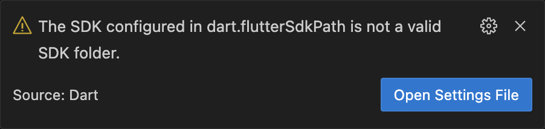

## The SDK Configured in dart.flutterSdkPath is not a valid SDK folder

If you encounter the following error during the onboarding process, please refer to the [Installation](./installation) page for detailed instructions on how to resolve it.
